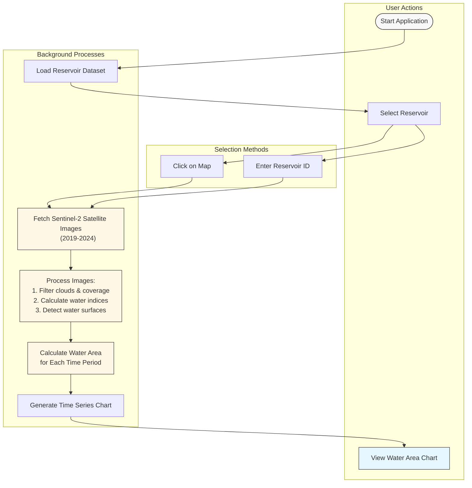

# Earth Engine Water Extent Models

This repository contains three Earth Engine models converted to Python. Each model estimates water extent using different data sources and methodologies.

## Files

- **app-water-extent.js**  
  The script loads a reservoir dataset and displays it on the map. It allows the user to select a reservoir—either by entering its objectid or by clicking on the map—and then analyzes the reservoir’s water extent over time using Sentinel‐2 imagery. The process includes filtering images for complete coverage, calculating NDWI to identify water pixels, and aggregating water area data which is then plotted in a chart.

- **hls_water_extent.js**  
  Processes NASA HLS data to compute NDWI, applies advanced cloud masking, extracts water vectors, and merges water extent geometries by date.

- **jrc_surface_water.js**  
  Computes monthly surface water area from the JRC Global Surface Water MonthlyHistory dataset for a given waterbody and exports the aggregated water extent time series as a CSV file.

## Requirements

- **Google Earth Engine Account:**  
  You must have an active Google Earth Engine account to run this script.
- **Asset Access:**  
  Ensure you have access to the asset:  
  `projects/ee-aciwrmgee/assets/reservoirVolume/Major_Reservoir_Karnataka`  
  If it's not public, request access from the asset owner.

## How to Create an Earth Engine Account

1. **Visit the Signup Page:**  
   Go to [Earth Engine Signup](https://signup.earthengine.google.com/).
2. **Submit Your Request:**  
   Fill in the required information and submit your application.
3. **Wait for Approval:**  
   Approval may take a few days. Once approved, you'll receive an email notification.

## How to Run the Script

1. **Log In:**  
   Access the Earth Engine Code Editor at [code.earthengine.google.com](https://code.earthengine.google.com/) and log in with your approved account.
2. **Create a New Script:**  
   Click on "New" to create a new script.
3. **Paste the Code:**  
   Copy the provided script into your new script file.
4. **Save and Run:**  
   Save your script and click the "Run" button.  
   - The map will display the reservoir layer.
   - A textbox in the bottom-left allows you to input a reservoir `objectid`.
   - Clicking on the map will also trigger the analysis.
5. **Interact:**  
   The UI will update to show water extent analysis over time through a chart.

